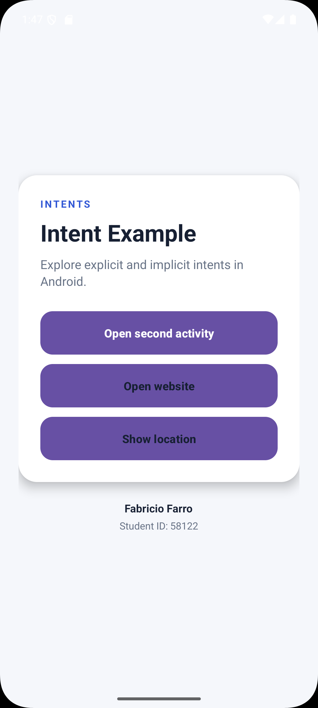
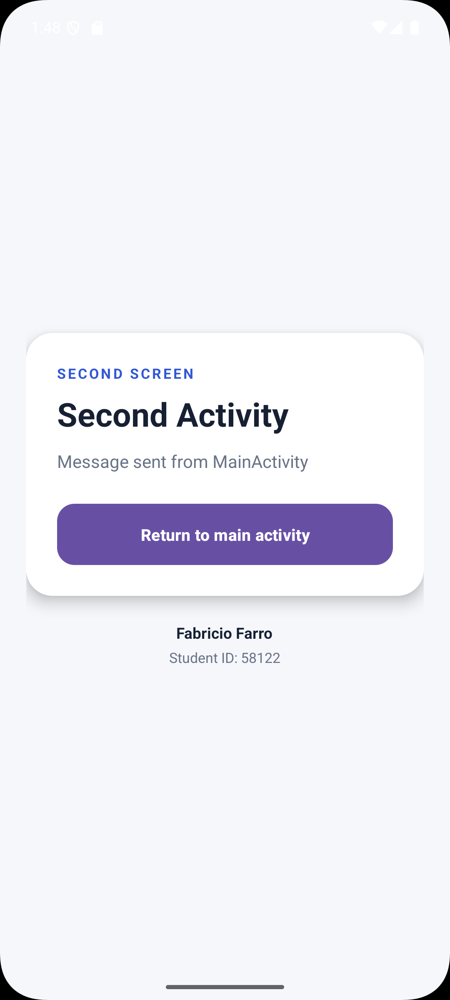
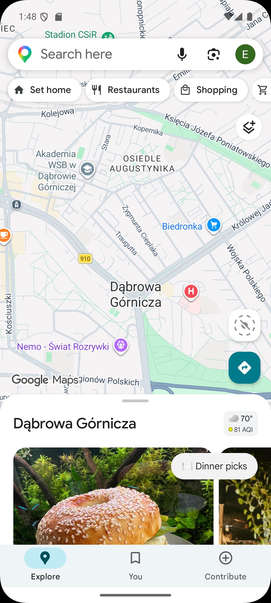

# IntentExample

A simple Android application demonstrating explicit and implicit intents using Java and XML.

## Features

- Open a second activity using an explicit intent
- Send a message between activities
- Open a website using an implicit intent
- Open a geographic location using an implicit intent

## Requirements

- Android Studio
- Android SDK
- Android emulator or Android device
- Java

## How to run

1. Open the project in Android Studio.
2. Wait for Gradle to finish syncing.
3. Select an emulator or connected Android device.
4. Run the application.

## Explicit Intent

The application uses an explicit intent to open `SecondActivity` from `MainActivity`.

The message is passed using an intent extra:

```java
Intent intent = new Intent(MainActivity.this, SecondActivity.class);
intent.putExtra("MESSAGE", "Message sent from MainActivity");
startActivity(intent);
```

`SecondActivity` retrieves the message using:

```java
Intent intent = getIntent();
String message = intent.getStringExtra("MESSAGE");
```

## Implicit Intent

The application uses an implicit intent to open a website:

```java
Uri uri = Uri.parse("https://www.android.com");
Intent intent = new Intent(Intent.ACTION_VIEW, uri);
startActivity(intent);
```

Android selects an application capable of handling the requested action.

The application also uses an implicit intent to open a geographic location:

```java
Uri uri = Uri.parse("geo:50.3217,19.1949");
Intent intent = new Intent(Intent.ACTION_VIEW, uri);
startActivity(intent);
```

## Explicit vs Implicit Intent

An explicit intent specifies the exact component that should handle the request. It is appropriate when launching a specific activity inside the same application.

An implicit intent specifies an action instead of a specific component. Android looks for an application that can handle that action. This is useful for tasks such as opening a website or displaying a location in a map application.

## Screenshots

### Main Activity



### Second Activity



### Website


### Location



## Author

Fabricio Farro

Student ID: 58122